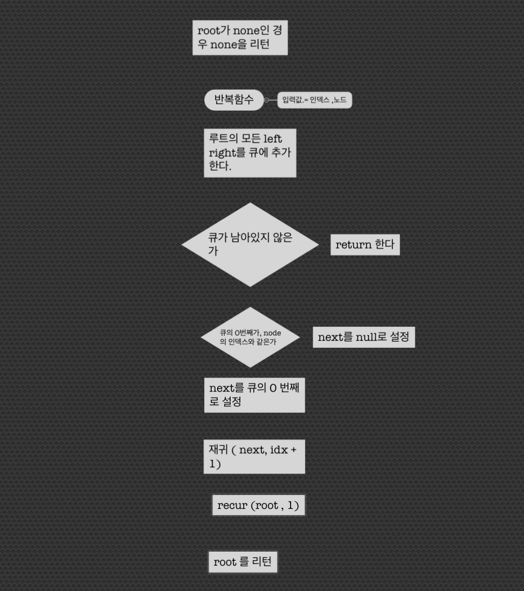
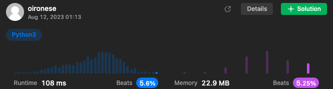

# 나는 아직 BFS알고리즘을 모른다.

장르: 나는 ~를 안다
생성 일시: 2023년 8월 12일 오전 1:18

# 알고 있는 것

BFS 알고리즘은 DFS알고리즘을 처음 접한 이후로 계속 궁금증이 남는 탐색 방법이었다. DFS가 현재 이동 가능한 경로를 모두 탐색한 후 돌아가는 타입이라면 BFS는 이동 경로에 대한 기록을 남긴후 그 때마다 

# 모르는 것

# 알게 된 것

### 1. 116번

주어진 완전한 이진트리에 대해서 같은 depth의 옆자리에 대한 정보를 알려주는 .next 속성을 채워라

입력값 분석: 완전 이진 트리, 중간에 빈 요소가 없기 때문에 반례의 걱정이 덜하다. 

Depth는 log n

출력값 분석: 완전 이진트리, in - place 알고리즘같이 원본을 그대로 변경시킨 후 리턴한다.

interface를 위해 두가지 알고리즘을 짠다 

알고리즘의 시간을 생각해본다면 

T(n) = T(n.left) + T(n.right) + f(1) 

완전 이진탐색이기 떄문에 2개의 브랜치를 반으로 나누어서 한다고 생각할 수 있었다. 

다만 내 풀이에서처럼 BFS, 즉 경로를 저장할 때 인덱스를 저장해야 하는지에 대해 의문이 남는다.

### 결과값

안타깝게도 만족스럽지 않은 결과물이 나왔다. O(n)보다 빠른시간안에 문제를 푸는 방법이 있을 거라는 뜻이다.

내 생각에는 이 알고리즘이 O(n) 처럼 여겨지지만 시간이 상당히 느린것에 대해 생각하기위해 다른 사람의 알고리즘을 연구했다.

### 다른 사람이 푼 알고리즘에 대한 연구

내가 확인한 답안의 주인은 3가지 방식으로 같은 문제를 풀었다. 그는 필요한 interface를 어떻게 구현했을까 ? 

내 풀이를 포함해서 이 문제를 고려할때 필요한 interface는 다음과 같다. 

1. 노드와 노드의 left, right가 있는지를 확인한다.
2. 층을 지키면서 각 층의 노드들을 엮는다 
3. 노드를 엮는 일이 끝나고 다음 쪽으로 이동한다

나는 이 2번을 구현하는  것이 굉장히 힘들다고 느껴졌다. 그렇기 때문에 매 노드에서 자신의 층을 저장할 수 있게 큐에 추가해 놓고 너비 우선 탐색을 한 것이다. 그 방식으로 성공했지만 시간이 오래걸렸다. 

그런데 내가 본 풀이에서는 이 2번을 이렇게 구분시키면서 해낸다

1. 노드와 노드의 left, right가 있는지를 확인한다.
    1. root를 대표할 cur을 할당하고  노드가 있는것을 확인한 root는 root.left로 옮긴다 ( 확인하지 않아도 됨)
    2. cur 에 대해서 left가 있는지를 조사한다
        1. 있다면 right도 자동적으로 있게된다
2. cur.left를 cur.right에 연결하고 cur의 next가 연결돼 있다면 ( 이 반복의 선에서 첫번쨰는 아니더라도 두번째 부터 연결돼있을 것이라 가정하면 여기서 넣을 수 있다 ) cur을 cur.next로 옮겨서 이동한다
3. 다음 작업으로 이동하는 일은 이미 root를 옮겨 놨기 때문에 자동으로 이루어진다

모든 과정이 물 흐르듯이 일어난다.